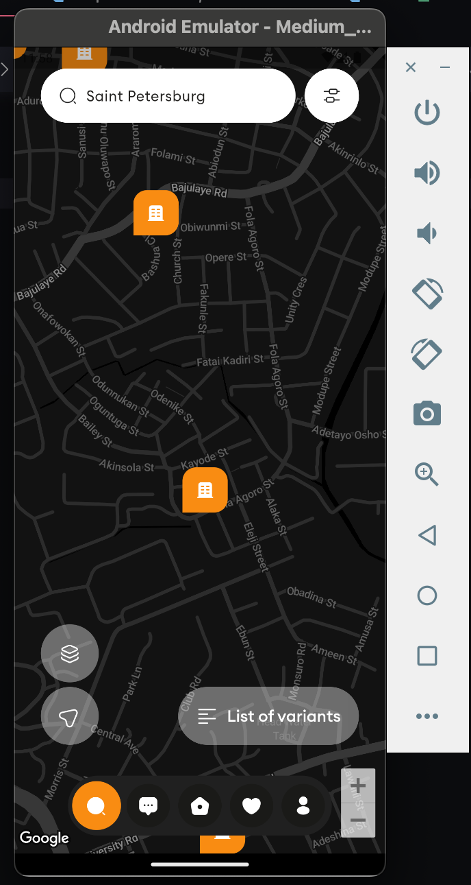
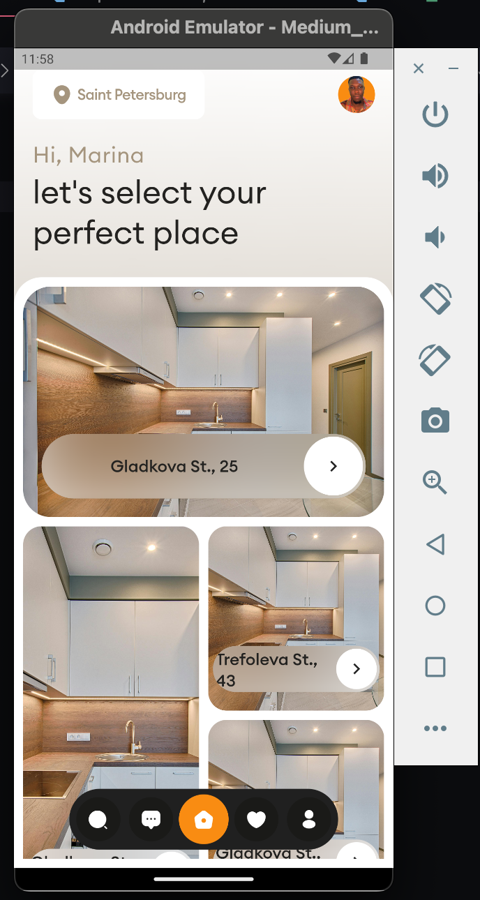

# Moniepoint Assessment

A Flutter Real Estate Animation and UI design


## Screenshots

<h4 align="center">




## Getting Started 🚀

1. Clone the project

```sh
git clone https://github.com/cscoderr/moniepoint_assessment
```

2. Navigate to the project directory

```sh
cd moniepoint_assessment
```

3. Add Google Map API Key
- iOS 
```AppDelegate.swift```
- Android 
```AndroidManifest.xml```

4. Install dependencies

```sh
$ flutter pub get
```

5. Run the applicaton on any connected devices

```sh
$ flutter run
```

